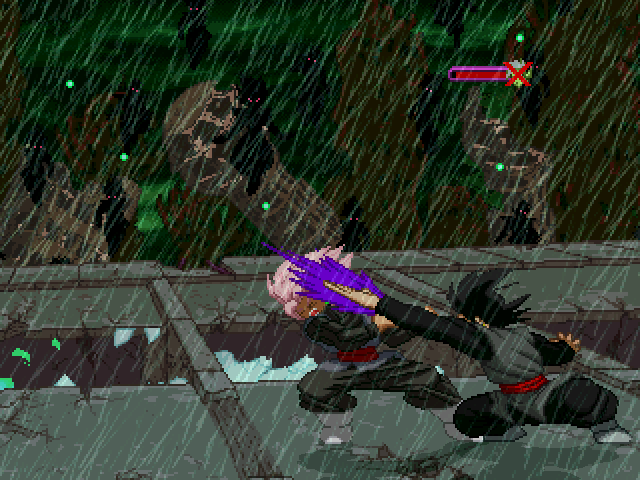
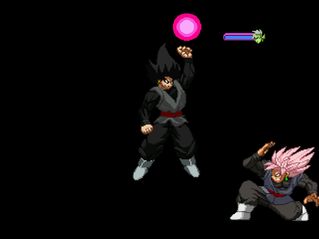
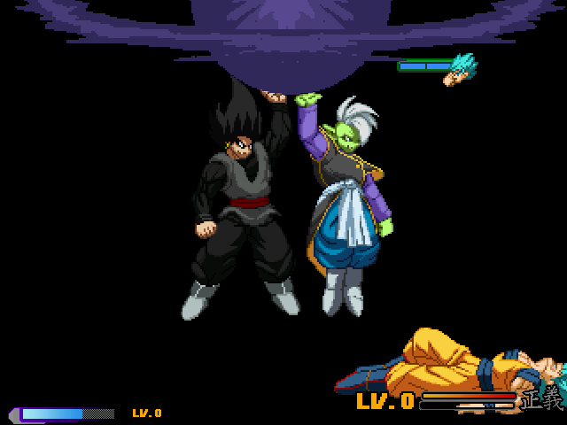
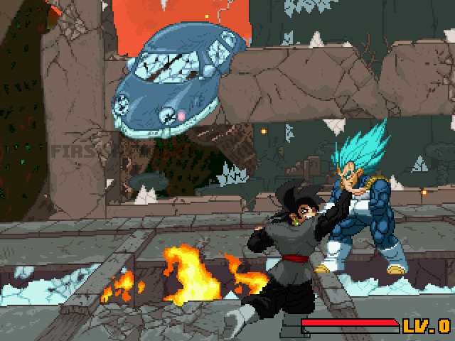

## Summary
A Z2 Inspired character of Base Goku Black. His playstyle is that of ranged focus, mixup character. 

He has sprites by Balthazer, edited by Bob Lee and Issei. He also has almost everything one would expect for a Z2 character. Including unique finishers, winposes, and intros.

# Screenshots

## Credits:
# Junny
Main author
# Team Z2
Template Z2 and Z2 compatibility.
# Yoshin
Various new sprites and FX animations
# Issei Hyodo and Bob Lee
Various new animations, made the resprite to add the earring and skirt
# Plusonblock
CS work
#Check The Def file for more in-depth credits

